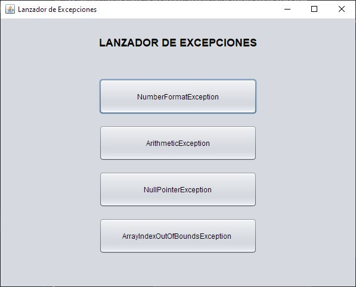

# LanzadorDeExcepciones

Programa que lanza 4 de las excepciones más comunes en Java.

* FormatNumberException
* ArithmeticException
* NullPointerException
* ArrayIndexOutOfBoundsException

## Características

* Uso de Java 8.2
* Uso de JDK 8

## GUI

